## Topics

* What is DSP and where it can be applied?
* Linear systems
* Fourier analysis
* Filter design in R

---

## What is Signal?

Anything that carries information is a signal


---

## What is DSP and where it can be applied?

The mathematics, the algorithms, and the techniques used to manipulate signals after they have been converted into a digital form.

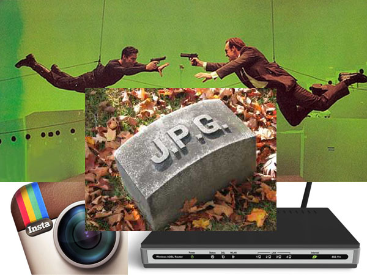

---

## Contineous and discrete

* Contineous f(t)
* Discrete (digital) f[t]

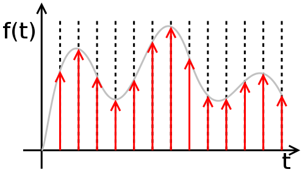

---

## Linear system

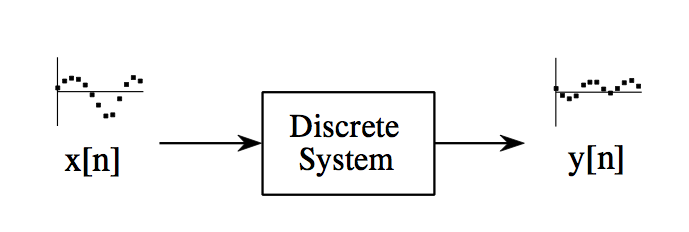

Examples: Wave propagation, resistors, capacitors, inductors, amplifiers, filters, mechanical interaction of masses, springs, echoes, resonances, image blurring...

---

## Linear system properties: Homogenity

Amplitude change in the input results in an identical amplitude change in the output.

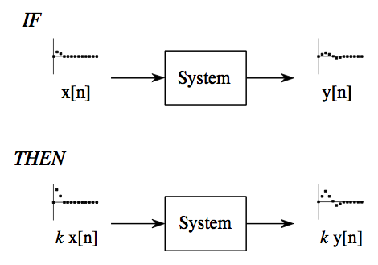

---

## Linear system properties: Additivity

Signals added at the input produce signals that are added at the output.

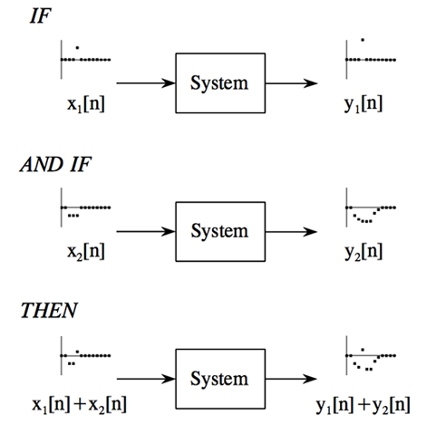

---

## Linear system properties: Shift invariance 

Shift in the input signal causes an identical shift in the output signal.

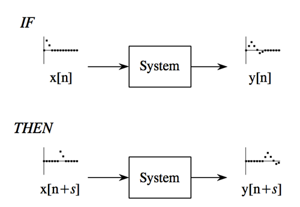

---

## Superposition strategy: divide-and-conquer 

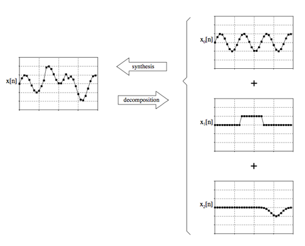

```
Synthesis: 5 + 10 = 15
Decomposition: 15 = 3 + 12 or 1 + 5 + 9 or ... 
```

---

## Superposition strategy: divide-and-conquer

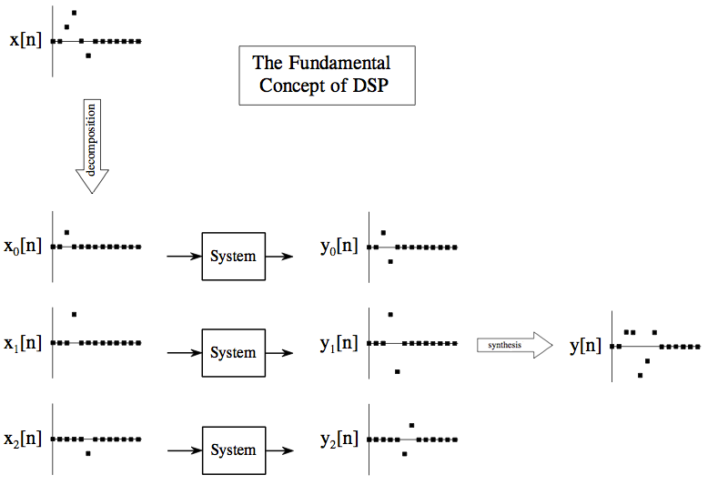

---

## Superposition strategy: divide-and-conquer

```
Divide-and-conquer: 1027 * 4 = 1000 * 4 + 20 * 4 + 7 * 4
```

### Intuition: No more complex signals! All we need to know is how simple signals are modified by a system.

---

## Two decompositions: Impulse and Fourier
### Impulse decomposition

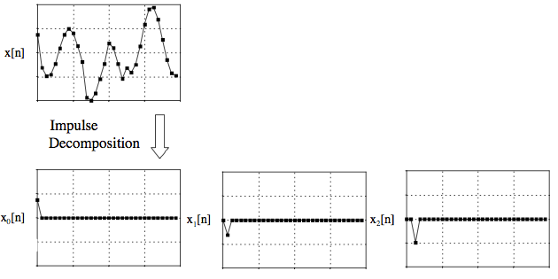

---

## Delta function and Impulse Response

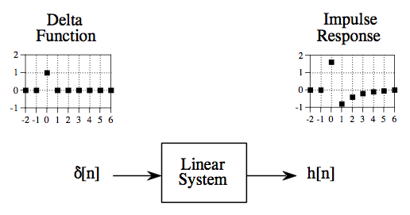

Same as filter kernel, convolution kernel, kernel, point spread function (image processing).

---

## Let's summarize

1. Input signal can be decomposed into a set of impulses
2. Each impulse can be viewed as a scaled and shifted delta function
3. Output signal can be found by adding these scaled and shifted impulse responses
(This operations is known as Convolution).

Intuition: If we know impulse response, then we can calculate the output for any possible input signal!

---

## Fourier decomposition

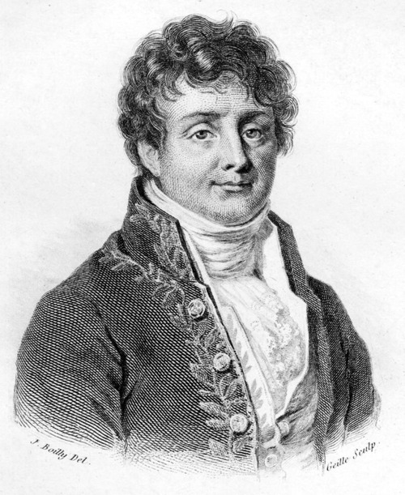

---

## Fourier decomposition


---

## DFT, IDFT, FFT


```r
signal <- rnorm(100)
fourier_transform <- fft(signal)

Re(fourier_transform)[1:5]
```

```
## [1] -4.874 -3.616 -9.085  5.431 -2.516
```


```r
Im(fourier_transform)[1:5]
```

```
## [1]  0.0000 -0.9916 10.2477 -1.5758 -0.3789
```

* Re[] - Cos, Index - Freq, Value - Amplitude
* Im[] - Sin, Index - Freq, Value - Amplitude

---

## Rectangular vs Polar

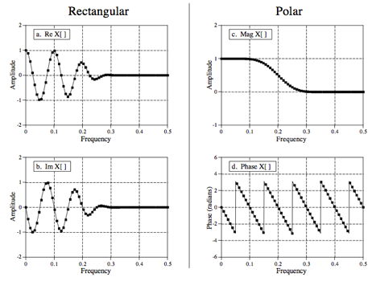


```r
Mod(fourier_transform)[1:5]
```

```
## [1]  4.874  3.749 13.695  5.655  2.545
```

---

## Furier analysis

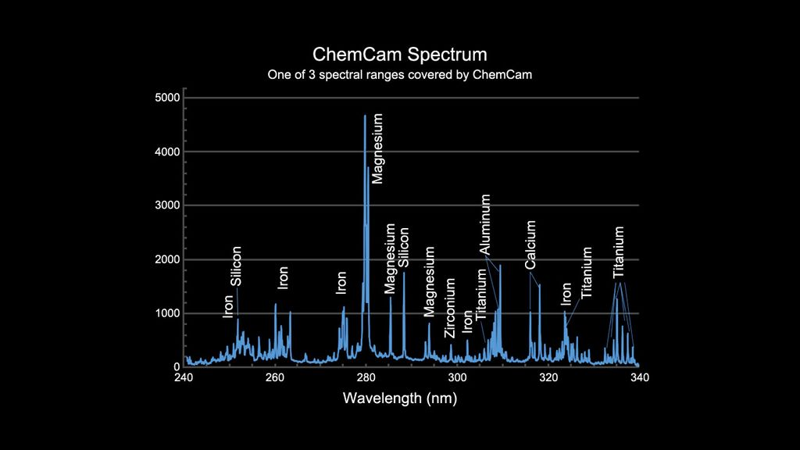

### Intuition: How much information/signal is presented on a given frequency

---

## Filter design

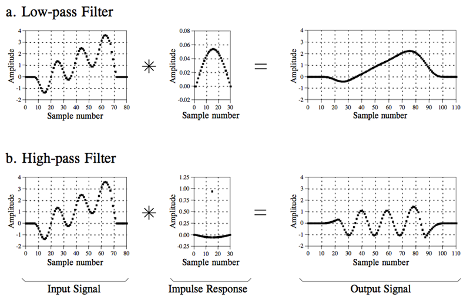

---

## Filter types 

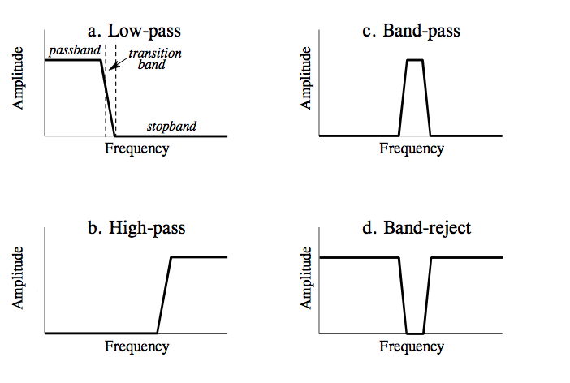

---

## Filter types

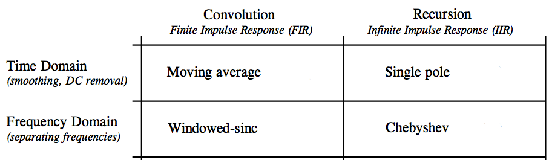

---

## Window Sinc Filter


```r
library(signal)
t <- as.vector(as.matrix(read.csv("data/data.csv", row.names = NULL, header = F)))  # 20 Hz 
plot.ts(t, ylab = "g", main = "User Acceleration")
```

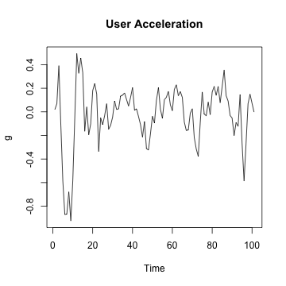 


---

## Window Sinc Filter


```r
filt <- fir1(15, 0.15, type = "low")  # 3 Hz low-pass filter
z <- filter(filt, t)  # apply filter
plot(z, col = "red", lwd = 3, type = "l", ylab = "g", main = "User Acceleration")
```

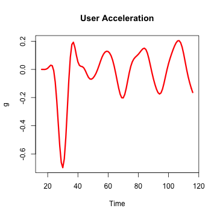 


---

## Credits

* [Steven W. Smith, The Scientist and Engineer's Guide to Digital Signal Processing](http://dspguide.com)
* Fourier decomposition from [Wikimedia Commons](http://commons.wikimedia.org/wiki/File:Fourier_series_and_transform.gif)
* ChemCam image from [NASA](http://www.nasa.gov)

---

## Questions?

### Nikolay Pavlov, Founder at Biomech
 
* E-mail: me@nikolaypavlov.com 
* Linkedin: http://linkedin.com/in/nikolaypavlov
* Facebook: http://www.facebook.com/pav.nikolay
* Twitter: @nikolaypavlov
* Github: https://github.com/nikolaypavlov
